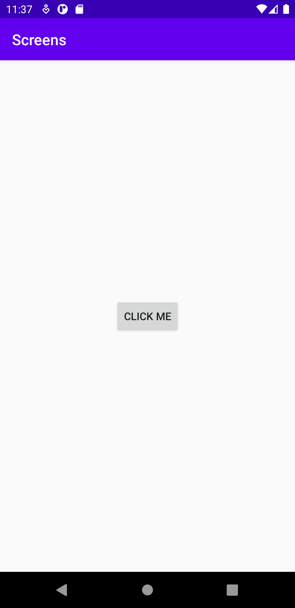
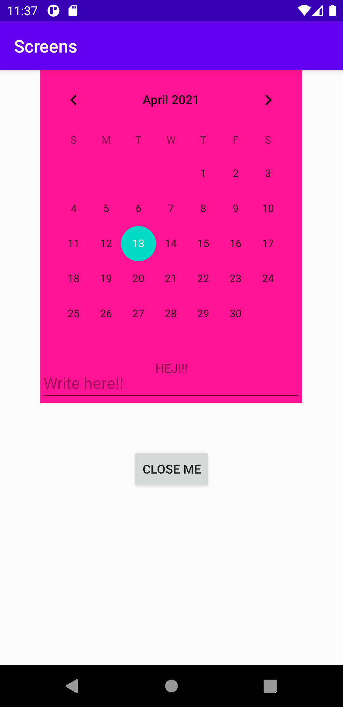

# Rapport Dugga4

Första steget var att skapa en ny activity. Detta gjordes genom att klicka på file och sedan välja new activity som jag valde att sätta som blank. Jag valde att döpa min till *SecondActivity*.

Sedan skapades en knapp activity_second filen och i activity_main.
```xml
<Button
        android:id="@+id/close_second_activity"
        android:layout_width="wrap_content"
        android:layout_height="wrap_content"
        app:layout_constraintBottom_toBottomOf="parent"
        android:layout_marginBottom="200dp"
        app:layout_constraintLeft_toLeftOf="parent"
        app:layout_constraintRight_toRightOf="parent"
        android:text="close me"/>
```

I activity main deklarerades sedan knappen och en `OnClickListener` kopplades till knappen som lyssnar på om knappen blir aktiv.
När knappen blir aktiv så skickas den vidare till *SecondActivity*  och värdet "HEJ!!" Genom kommandot Intent som bestämmer vad som ska hända vid aktivering. Genom att skapa en new intent som säger att när vi är i *MainActivity* så ska vi till *SecondActivity*.

```java
Button button = findViewById(R.id.open_second_activity);
        button.setOnClickListener(new View.OnClickListener() { //sätter en listener på knappen.
            @Override
            public void onClick(View v) {
                Intent intent = new Intent( MainActivity.this, SecondActivity.class); //bestämmer vad som ska hända efter knappen är tryckt.
                intent.putExtra("name", "HEJ!!!");
                startActivity(intent);


            }
```

I *SecondActivity* filen så deklarerades en `Bundle` som gnyter samman intenten från förra sidan med funktionen extras som hämtar strängen `namn` med värdet "HEJ!!" när extras inte är tom.

```java

        Bundle extras = getIntent().getExtras();        //Sammlar getintent.getextras om intent inte är tom så skickas strängen namne.
        if (extras != null) {
            String name = extras.getString("name");
            textView.setText(name);

        }
```

Sista steget var att deklara en ny knapp i *SecondActivity* för att ta oss tillbaka till *MainActivity*.
```java
Button close = findViewById(R.id.close_second_activity);   //Kallar på id
        close.setOnClickListener(new View.OnClickListener() { // Sätter on onclick listner som lyssnar på knappen.
            @Override
            public void onClick(View v) {
                finish();
```

För att skapa ett fragment så går vi till layout och sedan höger klickar och väljer *new - fragment - blank fragment*.

Längst ner i java filen för BlankFragment så hittar vi id:et på filen som är `"blank_fragment".`
Fragmentet lades sedan i *activity_second.xml*

I name så länkar vi hela addressen till fragmentet filen.

```xml
    <fragment
    android:name="com.example.screens.BlankFragment"
    android:layout_width="300dp"
    android:layout_height="380dp"
    android:tag="blank_fragment"
    app:layout_constraintBottom_toBottomOf="@+id/text_id"
    app:layout_constraintEnd_toEndOf="parent"
    app:layout_constraintHorizontal_bias="0.495"
    app:layout_constraintStart_toStartOf="parent"
    app:layout_constraintTop_toTopOf="parent"
    app:layout_constraintVertical_bias="0.0" />
```

I fragment filens egna xml fil i layout mappen så ändrade jag backgrundsfärg

```xml
<FrameLayout xmlns:android="http://schemas.android.com/apk/res/android"
    xmlns:tools="http://schemas.android.com/tools"
    android:layout_width="match_parent"
    android:layout_height="match_parent"
    android:background="@color/colorPink"
    tools:context=".BlankFragment">
```

Färgen la jag till i *colors.xml*
```xml
<color name="colorPink">#FF1493</color>
```

 Till sist så la jag till två widgets:

 CalenderVView

 ```xml
 <CalendarView
        android:id="@+id/calendarView"
        android:layout_width="wrap_content"
        android:layout_height="wrap_content"
        android:layout_gravity="top"
        />
```

EditText

```xml
<EditText
            android:layout_width="match_parent"
            android:layout_height="40dp"
            android:hint="Write here!!"
            android:layout_gravity="bottom"
            />
```

Resultat bild:

First Activity



Second Activity + Fragment




